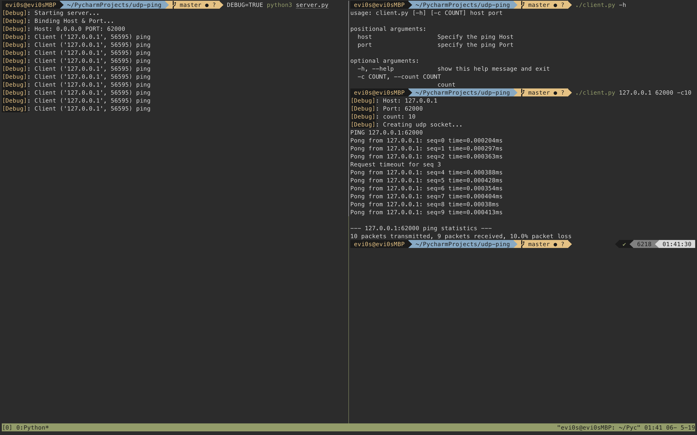
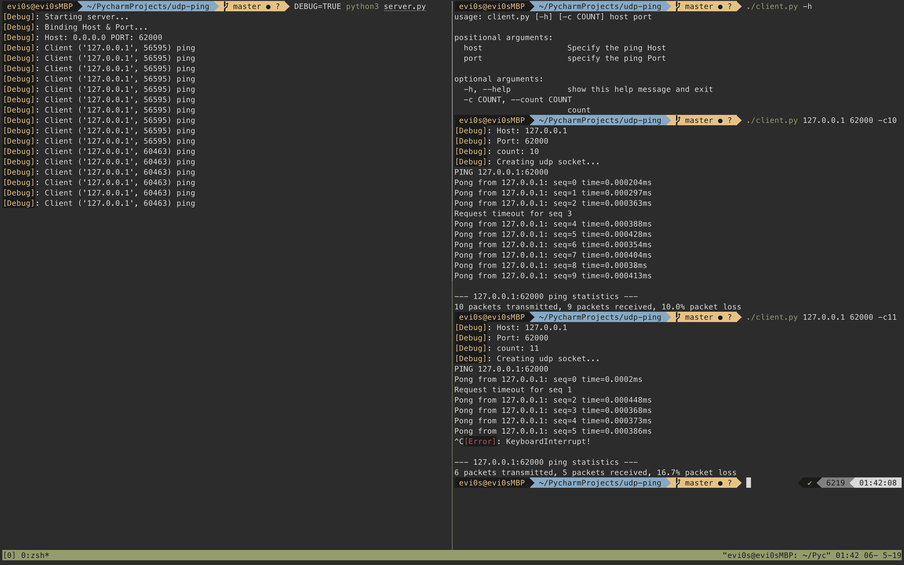

# udp-ping

UDP Ping 

计网作业 awsl

*python version: 3.7*

## Usage

### Server

```bash
python3 server.py
```

Available configs

* `L9` **host** Default: 0.0.0.0
* `L10` **port** Default: 62000

Environments

* **DEBUG** Show debug information if `DEBUG` is set

### Client

```bash
chmod +x client.py
./client.py <host> <port> -c4
```

Show help info

```bash
./client.py --help
```

## Detail

### server.py

Create an UDP Ping server socket to receive client ping request.

`L35` - `L37`: Simulate packet loss in UDP transmissions

Other detailed info is in the debug info & code comments

### client.py

*Executable file - CLI*

Send packets to UDP server and try to receive pong

Other detailed info is in the debug info & code comments

## Screen Shots






